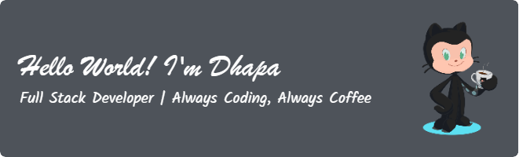

<!-- Banner Contribution GIF -->

  

  🚀 Tech Explorer · 🎨 Creative Developer · 🧠 Lifelong Learner

---

### 🔍 About Me

  Hi, I’m Dhapa.  
  I love coding, debugging, and pretending I understand the error messages.  
  When I’m not in front of my computer, you can find me drinking coffee and contemplating life’s biggest mysteries — like why semicolons exist in JavaScript.

  

---

### 🌱 Currently Learning
- 🖥️ Frontend Frameworks (React)  
- 🎨 Tailwind CSS & Desain Utility-First  
- 📱 Responsive Web Design & Mobile-First Approach  
- 🧩 State Management (Redux, Context API)

---

### 🛠️ Tech Stack

  
  
  
  
  
  
  

---

### 📊 My GitHub Stats

  

---

### 🤝 Let’s Connect!
- 📬 [Email](mailto:nyxsync.io@gmail.com)  
- 📸 [Instagram](https://instagram.com/alwayzzselalu)   

---

### 🎯 Fun Facts
- ☕ I run on coffee, code, and occasional snacks.  
- 💻 My first project was a simple "Hello World" in JavaScript.  
- 🎮 When I'm not coding, you can find me gaming or binge-watching tech tutorials.  
- 🧑‍💻 I love breaking things down and figuring out how they work (yes, even my own code).  
- 🎧 Coding feels smoother when the beat hits just right.

---

<picture>
  <source media="(prefers-color-scheme: dark)" srcset="https://raw.githubusercontent.com/Mhmmddhapa/Mhmmddhapa/output/pacman-contribution-graph-dark.svg">
  <source media="(prefers-color-scheme: light)" srcset="https://raw.githubusercontent.com/Mhmmddhapa/Mhmmddhapa/output/pacman-contribution-graph.svg">
  
</picture>
